# 🧪 Lab: Capturing a Packet Using Wireshark

---

## 📌 Objective

Capture and analyze network traffic to understand communication patterns and identify potential security risks.

---

## 🧰 Tools

- Wireshark
- Web Browser

---

## 🌐 Step 1: Interface Selection

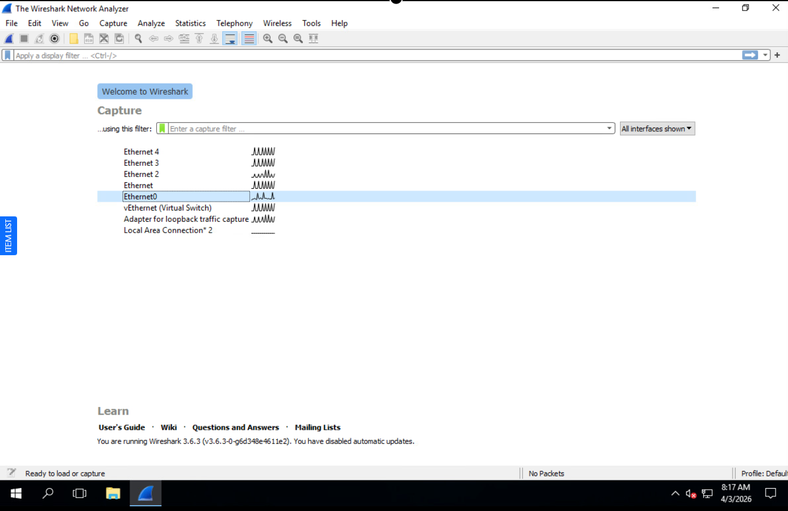

Selected active network interface with live traffic.

---

## ▶️ Step 2: Start Capture

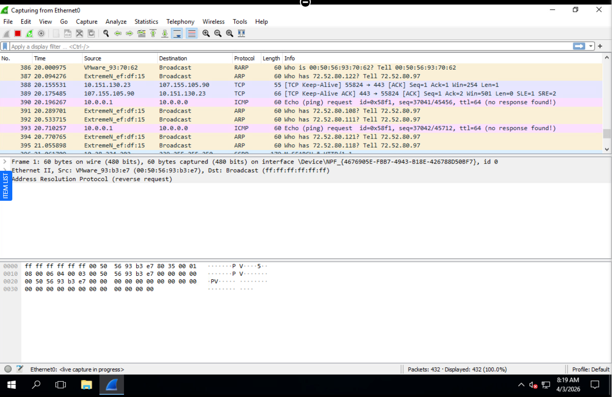

Packet capture initiated.

---

## 🌍 Step 3: Generate Traffic

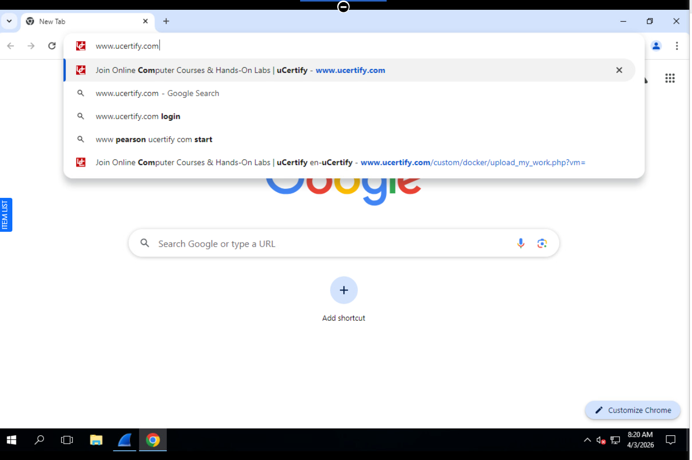

Accessed website to generate network traffic.

---

## 📡 Step 4: Captured Packets

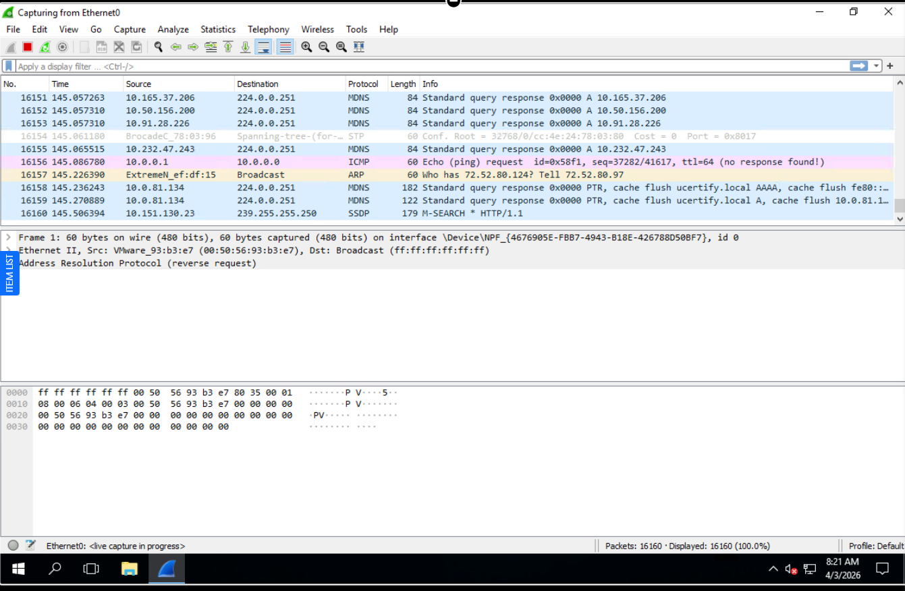

Packets successfully captured.

---

## 🔍 Step 5: HTTP Filter

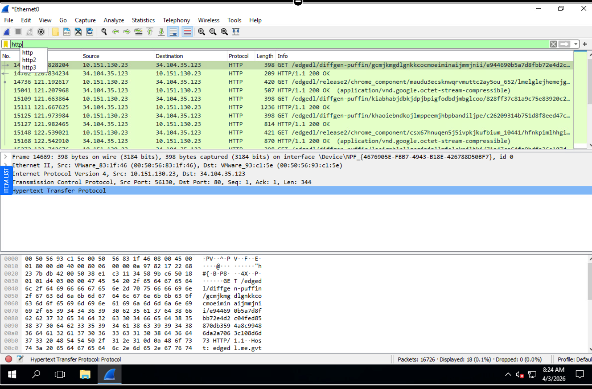

Filtered traffic using `http`.

---

## 📋 Step 6: Packet List

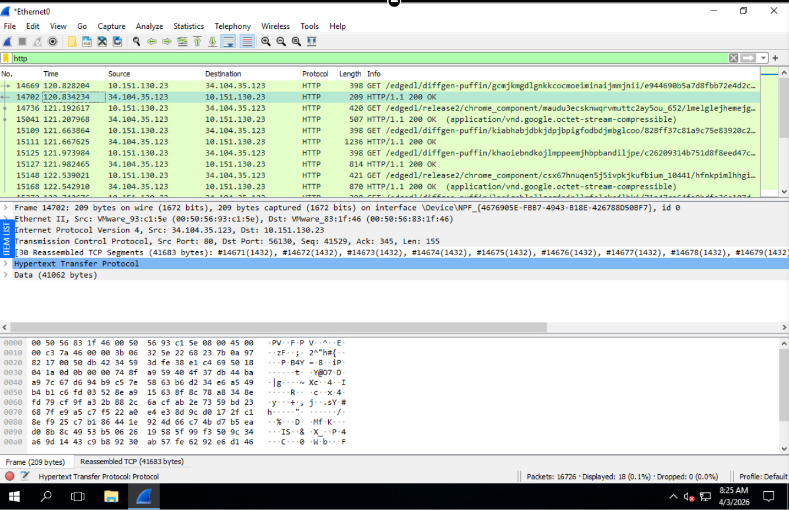

Observed communication between client and server.

---

## 🧠 Step 7: Packet Details

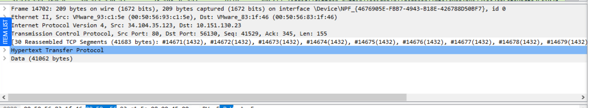

Inspected protocol layers: IP, TCP, HTTP.

---

## 🔎 Step 8: HTTP Fields

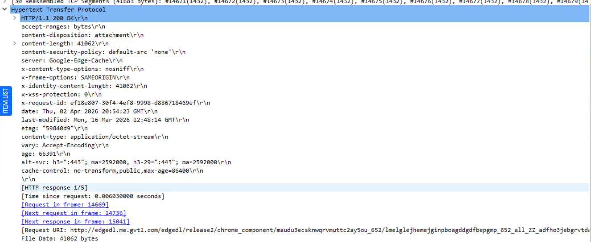

Identified:
- GET request
- Host
- User-Agent

---

## 🔗 Step 9: TCP Stream

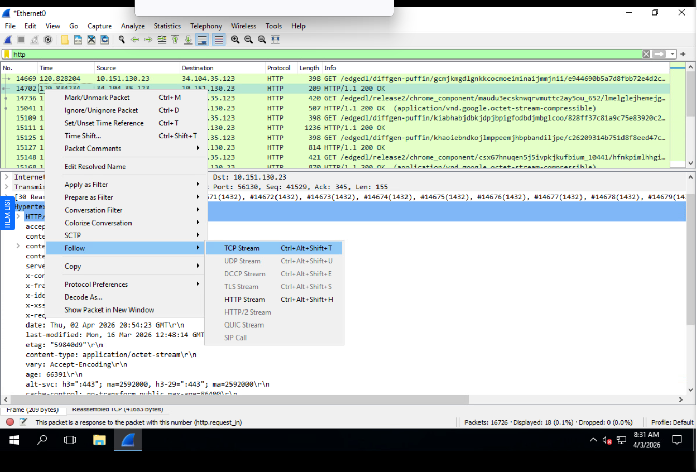  
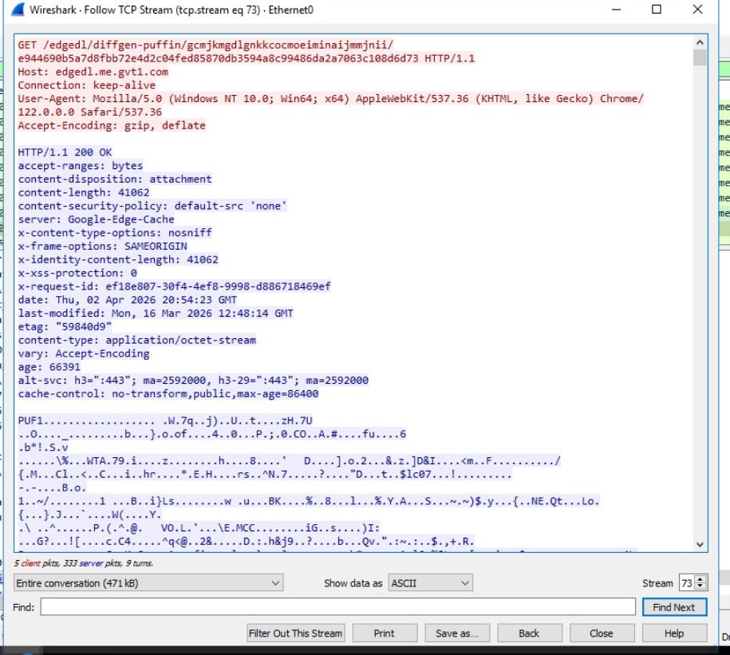

Reconstructed session data.

---

## 🌐 Step 10: HTTP Stream

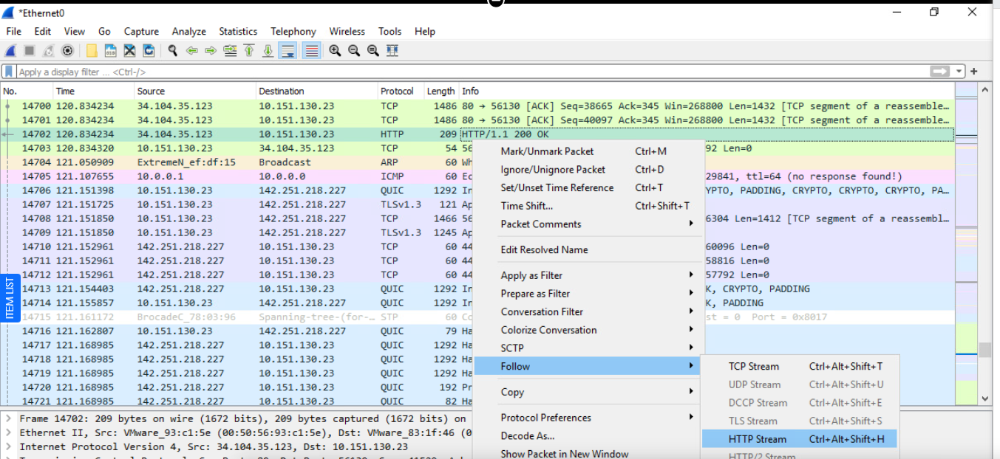  
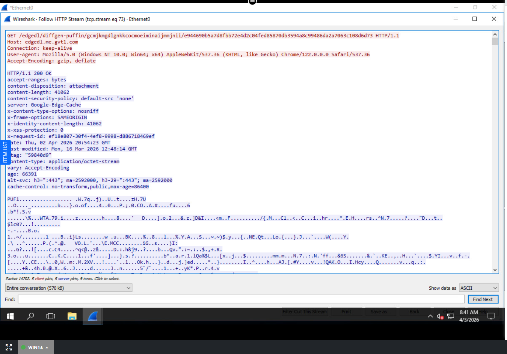

Viewed full request/response.

---

## 💾 Step 11: Save Capture

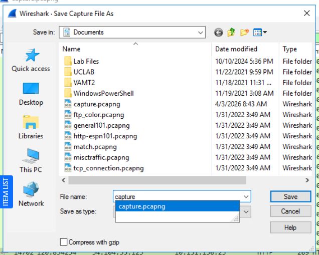

Exported `.pcapng` file.

---

## 🚨 Key Findings

- HTTP traffic is unencrypted  
- Data visible in plaintext  
- Sessions can be reconstructed  
- Potential credential exposure  

---

## 🧠 SOC Insight

This demonstrates how attackers can intercept sensitive data over insecure protocols and how analysts detect it.

---

## 🎯 Conclusion

Wireshark is essential for packet analysis, incident response, and network forensics.
